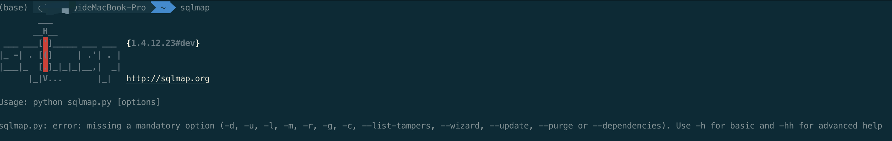

# sqlmap初识
## sqlmap探索
### 1、什么是sqlmap
sqlmap 是一个开源渗透测试工具，它可以自动检测和利用 SQL 注入漏洞并接管数据库服务器。它具有强大的检测引擎，同时有众多功能，包括数据库指纹识别、从数据库中获取数据、访问底层文件系统以及在操作系统上带内连接执行命令。  
简单来说，是一个可以自动对注入点进行sql注入的尝试工具  
### 2、sqlmap简介
```
官网：http://sqlmap.org/
github：https://github.com/sqlmapproject/sqlmap/zipball/master
```  
**sqlmap支持的数据库：**  
MySQL, Oracle,PostgreSQL, Microsoft SQL Server, Microsoft Access, IBM DB2, SQLite, Firebird,Sybase和SAP MaxDB等  
**注入方式：**  
l  基于布尔的盲注，即可以根据返回页面判断条件真假的注入；  
l  基于时间的盲注，即不能根据页面返回内容判断任何信息，用条件语句查看时间延迟语句是否执行（即页面返回时间是否增加）来判断；  
l  基于报错注入，即页面会返回错误信息，或者把注入的语句的结果直接返回在页面中；  
l  联合查询注入，可以使用union的情况下的注入；  
l  堆查询注入，可以同时执行多条语句的执行时的注入。  
**sqlmap搭建：**  
（1） python环境（本人使用anconda)  
（2） 可通过官网下载，按系统下载后可使用  
（3） 官网在国内不易访问，可直接对github或者gitee上的项目进行clone，通过python进行使用
``` 
附gitee地址：git clone https://gitee.com/vue-quasar/sqlmap.git
```  
可通过对应路径直接使用，或者对环境变量进行配置后可通过sqlmap命令直接使用
```
mac中配置shell：
alias sqlmap='python /Users/xxxx/yq_code/sqlmap/sqlmap.py'
```
最后可直接通过sqlmap使用（如下图）：

至此sqlmap已经进入使用前的基础状态
### 3、sqlmap命令参数
**指令集**
```
u 指定目标URL (可以是http协议也可以是https协议)
-d 连接数据库
--dbs 列出所有的数据库
--current-db 列出当前数据库
--tables 列出当前的表
--columns 列出当前的列
-D 选择使用哪个数据库
-T 选择使用哪个表
-C 选择使用哪个列
--dump 获取字段中的数据
--batch 自动选择yes
--smart 启发式快速判断，节约浪费时间
--forms 尝试使用post注入
-r 加载文件中的HTTP请求（本地保存的请求包txt文件）
-l 加载文件中的HTTP请求（本地保存的请求包日志文件）
-g 自动获取Google搜索的前一百个结果，对有GET参数的URL测试
-o 开启所有默认性能优化
--tamper 调用脚本进行注入
-v 指定sqlmap的回显等级
--delay 设置多久访问一次
--os-shell 获取主机shell，一般不太好用，因为没权限
-m 批量操作
-c 指定配置文件，会按照该配置文件执行动作
-data data指定的数据会当做post数据提交
-timeout 设定超时时间
-level 设置注入探测等级
--risk 风险等级
--identify-waf 检测防火墙类型
--param-del="分割符" 设置参数的分割符
--skip-urlencode 不进行url编码
--keep-alive 设置持久连接，加快探测速度
--null-connection 检索没有body响应的内容，多用于盲注
--thread 最大为10 设置多线程
```
后续对各参数进行单独测试