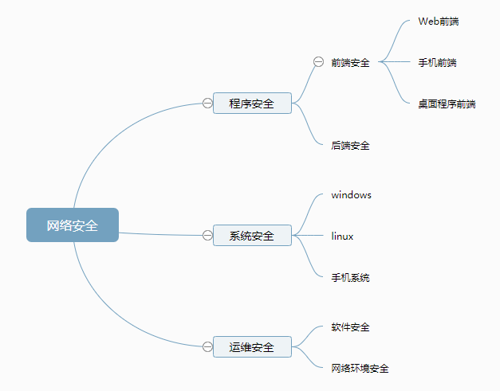
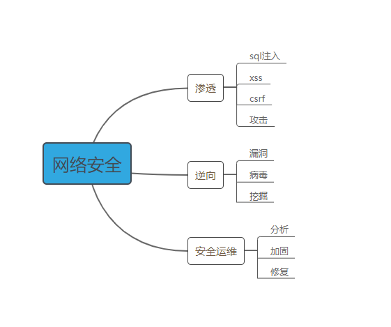

# 一、网络安全——初识

## 何谓网络安全：

​	网络安全是指网络系统的[硬件](https://baike.baidu.com/item/硬件/479446)、[软件](https://baike.baidu.com/item/软件/12053)及其系统中的数据受到保护，不因偶然的或者恶意的原因而遭受到破坏、更改、泄露，系统连续可靠正常地运行，[网络服务](https://baike.baidu.com/item/网络服务/9498645)不中断。

### 个人理解：

​	故名思义，网络安全从跟本上会分为软件和硬件两个方向，由于笔者是搞软件的，所以主要方向为软件。其次所有能够影响网络系统正常操作，都可认为是危及网络安全的行为，而对这些行为进行预防及保护就是网络安全。网络安全是一系列保护及预防行为的统称。

​	现在更多的体现或者说网络上最广泛的体现是渗透测试或者说web渗透测试，其原因更多是因为it技术在向各个方向上发展的越来越精细，需要投入的时间成本也就会越来越多，所以网络安全也呈现出专业话，相对上更多的安全人士会有自己专精的一面，比如web安全，逆向，运维这样大的方向区分，又或者从漏洞挖掘和工具研发来区分，这样以矩阵形式具体细分将会更加详细，同时在各方向上又会对其他方向有些许联系，所以要想学习网络安全，选择自己喜欢的领域，深入研究，同时其他领域也需要跟进。

​	与软件开发的区别：由于笔者是一名开发进行探索，故感觉与开发是有相当多的区别的，如：

	1. 思维方式，软件开发过程是一个创造过程，是一个想法逐渐丰满的过程，更多的考虑当然是以产品功能和易用为主（当然在安全形势日益严峻的现在，安全需求也在更加重视），而网络安全是在一个破坏者的角度去考虑整个过程，比如逻辑漏洞等，着眼点不在于功能，而在于缺陷或者在于规则上，他们会尝试进行各种规则上的破坏（有时候想法甚至反人类）
 	2. 技能需要，以开发来说，学习路线以计算机基础，网络，语言，算法，模式，系统这样逐步加深，又从方向上分为前端，后端，数据库等，而安全人员学习路线更加的广而杂，但对于开发能力却并不一定要求，更多的是需要了解

### 简单划分：（不包含硬件）

#### 	从漏洞位置层面划分

​	程序安全：即为所开发的软件相关安全

​	系统安全：应用所在系统相关的安全

​	运维安全：应用运行期间网络和对应相关支持软件的安全

#### 从手段上划分：

​	

渗透：当下网络安全测试主要手段，主要包括漏洞查找，应用，形式多种多样，更包括对前端，后端，服务器等多个角度的漏洞应用

逆向：主要通过代码还原的方式来进行漏洞的查询，病毒的制作挖掘等

安全运维：主要以防御和应急为主。

下一篇将会进行网络安全中渗透的介绍。

##最后：

希望大家多支持！

公众号：pmer_infosafe（程序猿玩安全）

二维码：