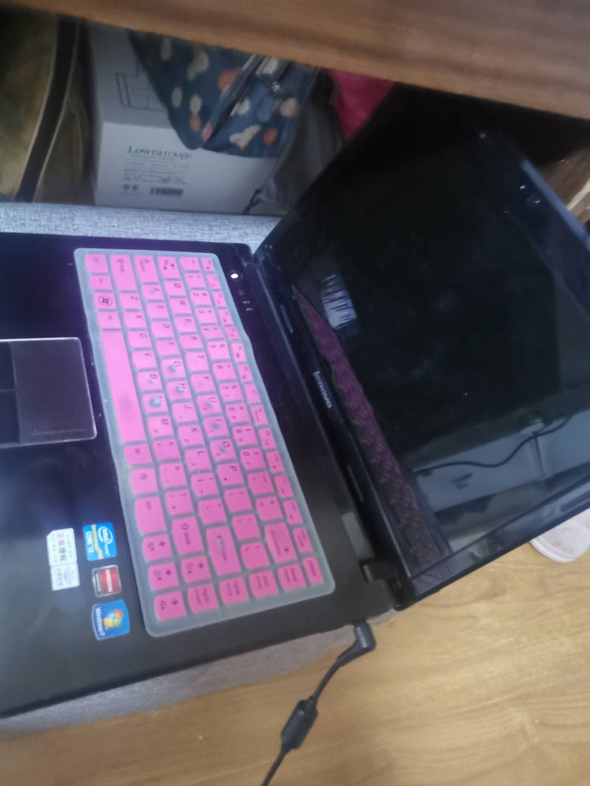
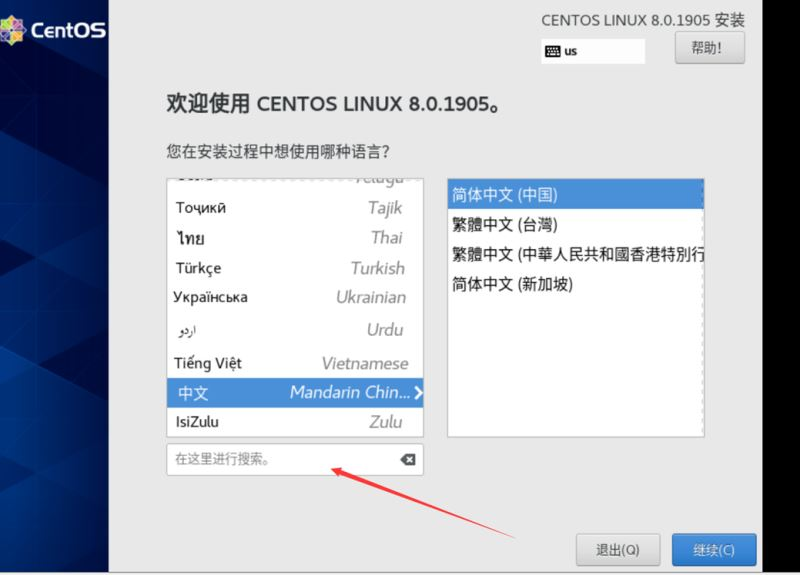
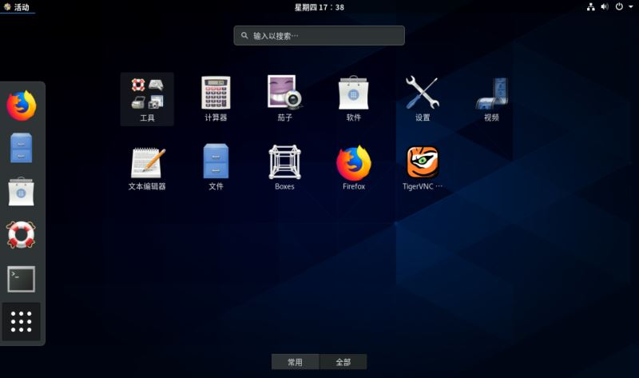
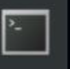
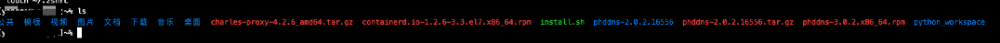
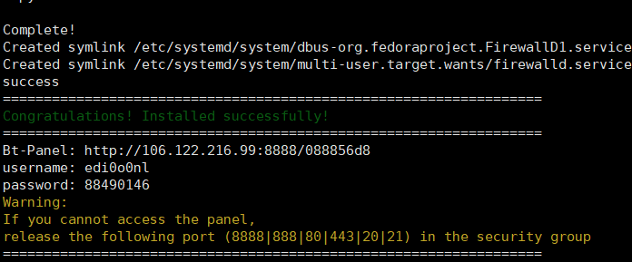

# 个人服务器搭建

## 一。服务器系统选择

考虑项：

​	首先当然是系统的种类，三大主流系统：windows，linux，mac。选择当然是linux，其他两种个人用一个不好用，一个太贵。

​	其次是linux的子品牌：

​	1、debian系主要有Debian，Ubuntu，Mint等及其衍生版本；

​	2、redhat系主要有RedHat，Fedora，CentOs等，

​	3、其它有Slackware，Gentoo，Arch linux，LFS，SUSE等。

​	选择上：如果开发用，推荐redhat系，业内公司的服务器多用centos，考虑到平时使用，那么就选择fedora，可以选择最新的发行版。如果简单用加开发，可以选择debian系，推ubuntu，mint。如果是技术狂型，那么就推荐Gentoo，Arch linux，LFS，Slackware等。最终本人选择了centos原因简单，免费，易用，教程多，同时本着找茬的目的，下载了最新的centos8，貌似与当下流行的6和7有很大的不同，之后的路程固定是艰辛的。

​	当然还有一些其他流行的相对小型的系统，如kali等，一般不用做服务器架设，未统计。

## 二。安装

​	由于本人选择的是一个老旧的笔记本，如图：



​	（请忽略我这粉色的键盘膜和家里的一些物品）所以对于这样一个把光驱拆了安上固态的电脑不能用常规方法：

第一次尝试：由于之前5年吧，曾经一时兴起安装过Ubuntu，当时安装过程简单具方便，所以自以为事的下载了centos的安装包进入了硬盘，之后直接企图安装成功，未曾想到，现在已经不接受这样的安装方式了，失败。

第二次尝试：之后尝试用之前安装windows的经验，通过大白菜进行引导安装，还是太天真了，发现那玩意只适合windows，失败。

最终解决：之后放弃自己是老鸟的想法，开始认真查看了下相关教程，通过虚拟光驱将u盘写入引导，成功进行安装。

附上下载链接：

阿里下载站，比较快一点，直接复制链接到迅雷就能下载了，大小约6.6G

https://mirrors.aliyun.com/centos/8.0.1905/isos/x86_64/CentOS-8-x86_64-1905-dvd1.iso

网易下载站

http://mirrors.163.com/centos/8.0.1905/isos/x86_64/CentOS-8-x86_64-1905-dvd1.iso 

当然还有不可少的官网，国内巨慢，但也给你们放出来

https://www.centos.org/download/

安装过程比较简单，由于没有其他系统，所以过程比较顺利，一路next通过。安装成功如图：



一通设置后并创建用户后进入系统，如图：



至此，系统安装完成，但整个搭建才刚刚开始，毕竟以服务器来要求，图形界面一点用没有。

## 三。系统搭建

​	终于开始系统的搭建了，首先打开我们的终端，



就这样的图标，打开就是我们熟悉的命令行了。

### 第一步：

​	千万不要着急下载和安装各种服务，以大众网速考虑，先换源

​	在网上查找了n种方式，由于centos8后开始使用dnf进行下载和安装，网上教程相当少，同时，尝试了很多都不太好用，最后找到 一个相对好用的方式，我换了阿里源，首先删除了/etc/yum.respos.d/下的文件，之后执行以下命令下载：

```linux
curl -o /etc/yum.repos.d/CentOS-Base.repo http://mirrors.aliyun.com/repo/Centos-8.repo
```

之后在执行

```linux
dnf clean all
dnf makecache
```

进行缓存建立

### 第二步：

​	换源后就可以开始下载了，首先进行了ssh的安装（实在是不想用这个快10岁的笔记本了）

```linux
dnf install openssh-server
service sshd restart
netstat -antp | grep sshd
```

### 第三步：

​	现在就可以进行远程连接了，打开我常用的笔记本，通过连接工具：

```linux
ssh root@ip
```

输入密码成功进入。如图：



​	之后为个人习惯，oh-my-zsh配置，大家可根据习惯选择：

本人参考：https://blog.csdn.net/amoscykl/article/details/80616873

### 第四步：

​	安装部分常用工具

```
yum install -y openssh-server vim lrzsz wget gcc-c++ pcre pcre-devel zlib zlib-devel ruby openssl openssl-devel patch bash-completion zlib.i686 libstdc++.i686 lsof unzip zip net-tools
yum install initscripts
yum install net-tools.x86_64
```

### 第五步：

​	为了便于管理安装宝塔工具，centos8实际没有专用版本，采用了最高版本是可用的，毕竟是大厂的，兼容是没什么问题的。

​	需要环境：python。

​	注意事项：其中python3默认可能python命令不能使用，需要通过软连接进行配置（可以理解为windows的环境变量之类的）

```linux
ln [option] existingfile newfile （sexistingfile 待建立链接文件的文件，newfile是新创建的链接文件）
```

安装后会显示



