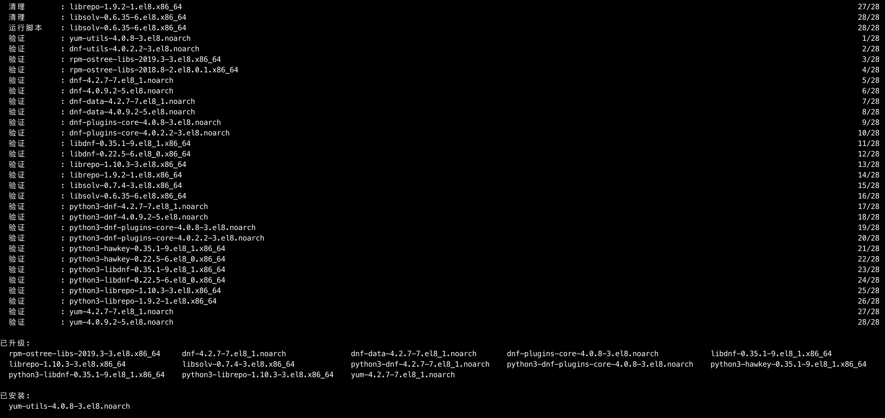
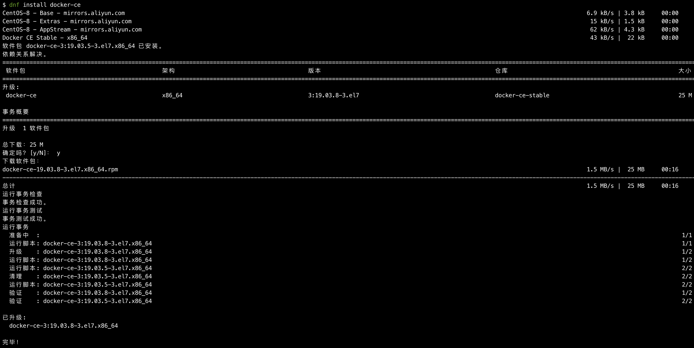

# 个人服务器搭建三

为了更方便的管理服务器的资源，方便及自由的部署，同时配合自己的微服务预期，引入docker概念，学习docker

## 什么是docker

业内形象为：鲸鱼。是一个开源的**容器**引擎，让开发者可以打包他们的应用以及依赖包到一个可移植的镜像中，	然后发布到任何流行的linux或者windows机器上，容器是完全使用**沙箱**机制，相互之间没有任何接口。

容器：简单的说，容器的一个单位，包含了完整的运行环境，除了应用程序本身之外，这个应用所需要的全部依赖、类库、其他二进制文件、配置文件等，都统一被打入一个称为容器镜像的包中，通过将这些容器化后，操作系统的发行版本和其他基础环境的差异就被抽像去掉了，可以参考理解虚拟机，但比虚拟机量级更轻。

​	通过容器概念，实现标准化，让镜像从一个环境移植到另一个环境变得更加容易和灵活，并且使容器间隔离做的更完善，一台宿主机上可以运行多个容器，但这些容器内的进程是相互隔离的，且无法相互感知。其中一个容器的升级或者出现故障，不会影响其他容器。

沙箱：是一个虚拟系统程序，允许你在沙盘环境中运行浏览器或其他程序，因此运行所产生的变化可以随后删除。它创造了一个类似沙盒的独立作业环境，在其内部运行的程序并不能对硬盘产生永久性的影响。 在网络安全中，沙箱指在隔离环境中，用以测试不受信任的文件或应用程序等行为的工具。

一个完整的Docker有以下几个部分组成：

1. DockerClient客户端
2. Docker Daemon守护进程
3. Docker Image镜像
4. DockerContainer容器

## 部署

### 一、安装

#### **第一步：安装工具包**

```$ sudo yum install -y yum-utils 		#安装工具包，缺少这些依赖将无法完成```

安装成功如图：



#### **第二步：设置远程仓库**

``` yum-config-manager --add-repo https://download.docker.com/linux/centos/docker-ce.repo```

执行结果：

``` 执行结果：
Loaded plugins: fastestmirror, langpacks
adding repo from: https://download.docker.com/linux/centos/docker-ce.repo
grabbing file https://download.docker.com/linux/centos/docker-ce.repo to /etc/yum.repos.d/docker-ce.repo
repo saved to /etc/yum.repos.d/docker-ce.repo
```

#### **第三步：安装docker**

``` yum install docker-ce```

成功后，如图：



到此安装成功

#### **第四步：使用**

**启动**：``` systemctl start docker```

**查看版本**：```docker version```

返回如：Client: Docker Engine - Community
 Version:           19.03.5
 API version:       1.40
 Go version:        go1.12.12
 Git commit:        633a0ea
 Built:             Wed Nov 13 07:25:41 2019
 OS/Arch:           linux/amd64
 Experimental:      false

Server: Docker Engine - Community
 Engine:
  Version:          19.03.8
  API version:      1.40 (minimum version 1.12)
  Go version:       go1.12.17
  Git commit:       afacb8b
  Built:            Wed Mar 11 01:25:42 2020
  OS/Arch:          linux/amd64
  Experimental:     false
 containerd:
  Version:          1.2.6
  GitCommit:        894b81a4b802e4eb2a91d1ce216b8817763c29fb
 runc:
  Version:          1.0.0-rc8
  GitCommit:        425e105d5a03fabd737a126ad93d62a9eeede87f
 docker-init:
  Version:          0.18.0
  GitCommit:        fec3683

至此，docker已经可以正常使用了，之后将继续进行docker服务部署