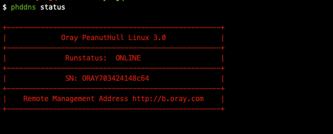

# 个人服务器搭建--二、内网穿透

上一章我们进行了个人服务器的基础搭建，但以个人来说，还有一个相当棘手的问题，如何能随时随地的由自己使用？

## 一、什么是内网穿透

因为我们大多是个人宽带，而个人宽带有时甚至一栋楼用一个ip，这时我们的服务器并不能进行外网访问，由于我们的服务需要对固定ip的固定端口进行绑定才能够进行访问，如果我们没有对应的外网ip，此时就不能通过正常的互联网进行访问，那么如何将在内网正常访问的服务通过外网可以进行访问呢，这就涉及到一个新的名词了--**内网穿透**。

**个人理解**：首先，你的服务器能联网，那么说明你从外网能够正常与你的服务器进行交互，此时只是你的电脑不能直接暴露在互联网中，所以，可以这样理解，如图：

外网请求会先找到A栋，然后在通过内网去找到A004，而内网穿透就是要把A004暴露到外面，让外网不需要经过A栋中转，可以想象为10086接线，人拨打10086，会有很多接线员，但你并不能直接找到某个接线员，此时就如同服务器一样，但如果我们把个人接线员绑定在1008601上，令我们拨打1008601时能直接联系到这个接线员，这样我们就算是实现了一个内网穿透的过程。

较官方的解释：服务商的服务器有独立ip，给你开个端口，把你的机器上的一个端口和服务器上端口建立一个通道，使别人能通过服务器ip对应端口访问到你机器对应的端口，即为内网穿透。

## 内网穿透工具

现有比较常见的有：Ngrok、小米球、Sunny-Ngrok、echosite、Ssh&autossh、Lanproxy、Spike、frp、fcn、花生壳

其中前5个都是基于国外的ngrok来进行二次开发的。

1、Ngrok
ngrok 是一个反向代理，通过在公共端点和本地运行的 Web 服务器之间建立一个安全的通道，实现内网主机的服务可以暴露给外网。ngrok 可捕获和分析所有通道上的流量，便于后期分析和重放，所以ngrok可以很方便地协助服务端程序测试。
2、Natapp
natapp是 基于ngrok的国内收费内网穿透工具，类似花生壳（收费较多，下面单独进行演示），有免费版本，比花生壳好。免费版本：提供http,https,tcp全隧道穿透，随机域名/TCP端口，不定时强制更换域名/端口，自定义本地端口
3、小米球
小米球是基于ngrok二次开发的内网穿透工具，支持多协议、多隧道、多端口同时映射(http、https、tcp等等...)，同时支持多种系统win、linux、linux_arm、mac等。具体的使用直接参考官网。
4、Sunny-Ngrok
Sunny-Ngrok同样是ngrok二次开发的内网穿透工具，支持http,https协议，同时支持更丰富的系统和语言：linux、win、mac、openwrt、 python、php等。
5、echosite
echosite同样ngrok二次开发的内网穿透工具，支持多种协议，以前是全部免费的，现在推出了收费版和免费版，可根据自己的需要去选择。
6、Ssh&autossh
ssh 配合autossh工具使用，因为autossh会容错，自动重新启动SSH会话和隧道。autossh是一个程序，用于启动ssh的副本并进行监控，在死亡或停止传输流量时根据需要重新启动它。 这个想法来自rstunnel（Reliable SSH Tunnel），但是在C中实现。作者的观点是，它不像匆匆忙忙的工作那么容易。使用端口转发环路或远程回显服务进行连接监视。在遇到连接拒绝等快速故障时，关闭连接尝试的速度。在OpenBSD，Linux，Solaris，Mac OS X，Cygwin和AIX上编译和测试; 应该在其他BSD上工作。免费软件。
7、Lanproxy
lanproxy是一个将局域网个人电脑、服务器代理到公网的内网穿透工具，目前仅支持tcp流量转发，可支持任何tcp上层协议（访问内网网站、本地支付接口调试、ssh访问、远程桌面...）。目前市面上提供类似服务的有花生壳、TeamView、GoToMyCloud等等，但要使用第三方的公网服务器就必须为第三方付费，并且这些服务都有各种各样的限制，此外，由于数据包会流经第三方，因此对数据安全也是一大隐患。
8、Spike
Spike是一个可以用来将你的内网服务暴露在公网的快速的反向代理，基于ReactPHP，采用IO多路复用模型。采用Php实现。
9、Frp
frp 是一个可用于内网穿透的高性能的反向代理应用，支持 tcp, udp, http, https 协议。利用处于内网或防火墙后的机器，对外网环境提供 http 或 https 服务。对于 http, https 服务支持基于域名的虚拟主机，支持自定义域名绑定，使多个域名可以共用一个80端口。利用处于内网或防火墙后的机器，对外网环境提供 tcp 和 udp 服务，例如在家里通过 ssh 访问处于公司内网环境内的主机。
10、Fcn
FCN[free connect]是一款傻瓜式的一键接入私有网络的工具, fcn利用公共服务器以及数据加密技术实现：在免公网IP环境下，在任意联网机器上透明接入服务端所在局域网网段。支持多种系统，有免费版和付费版。

## 三、尝试搭建

下面进行几种常用的方式：

### 1. 花生壳：

先进行安装，通过以下命令进行安装：

`rpm -ivh phddns-3.0-1.x86_64.rpm`

安装后查看功能：

`**phddns start**（启动）| **stop**（停止）| **status**（状态）| **restart**（重启）|
**phddns reset**（重置）
**phddns version**（版本）`

安装后如图：

之后通过图片中的网址及sn码与个人账号进行绑定，成功后如图：

之后便可以进行对应的外网访问，当然由于网络管制的原因，个人用户功能较少，且收费较高，但优点在于稳定且好用。

### 2.**ngrok**：

与花生壳安装方式相近，但可以自己搭建，现尝试自己搭建

参考文章：https://blog.csdn.net/yjc_1111/article/details/79353718

本人已经实现，可用。

附赠更多类型的工具相关教程

参考文章：[NATAPP1分钟快速新手图文教程](https://natapp.cn/article/natapp_newbie)

[Sunny-Ngrok使用教程](https://www.ngrok.cc/_book/)

[EchoSite---让内网穿透变得简单](https://blog.csdn.net/interesting0303/article/details/81098603)

[SSH内网穿透](https://yangqiang.im/?p=698)

[业余草推荐一款局域网（内网）穿透工具lanproxy](https://blog.csdn.net/xmtblog/article/details/77943159)

[使用 PHP 实现的的内网穿透工具 “Spike”](https://segmentfault.com/q/1010000009955702)

[一款很好用的内网穿透工具--FRP](https://www.jianshu.com/p/00c79df1aaf0)、[使用frp实现内网穿透](https://sunnyrx.com/2016/10/21/simple-to-use-frp/)

[内网穿透工具FCN介绍](http://www.sohu.com/a/202331135_449548)

到此，完成内网穿透教程，后续将开始进行自己的服务制作与搭建

Natapp

小米球

Sunny-Ngrok

echosite

Ssh、autossh

Lanproxy

Spike

frp

fcn

花生壳