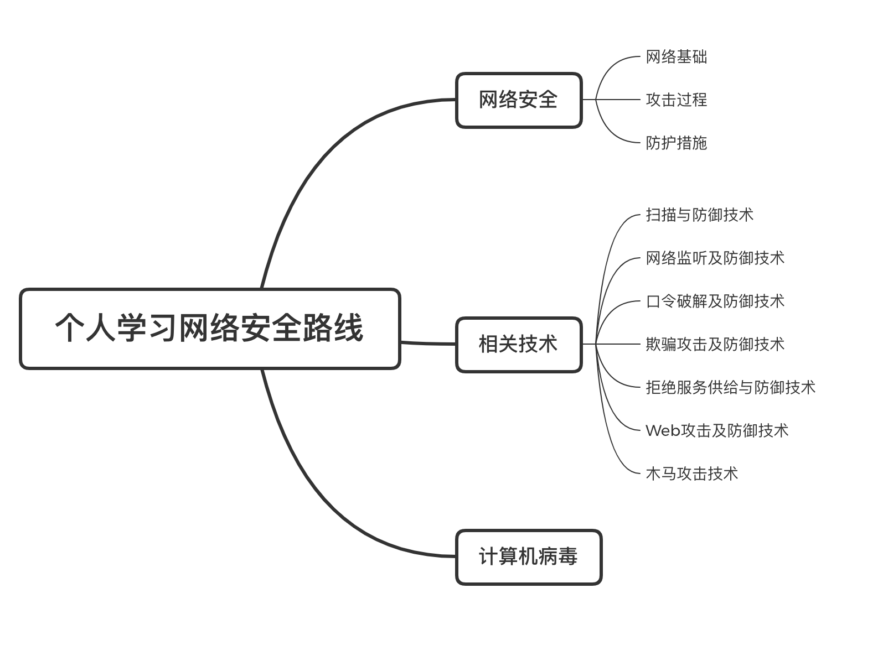

# **第一篇**：安全学习路线研究

## 一、自我猜想：

​	跟据自己接触的，对相关知识应有以下了解：

  - 社会工程学：大神们俗称社工，安全研究的基础，不仅需要了解目标，同时更多的安全问题，或者说漏洞是从多个维度出现，甚至由于开发人员性格习惯之类的原因来定位漏洞。通常来说，社会工程学的思想渗透在整个项目的各个动作之中，如广为人知的密码爆破来说，其中密码的自定义种子，一般就是通过社会工程学得确定的。

  - 系统:其中包括使用各种工具时需要用到的本地系统和对应服务器的特性。

  - 加密：不得不提的就是加密手段，不管是登录，还是正常访问，在网络安全的日益严峻的现在，几乎所有的网络连接都有对应的加密和传输手段，在破解及测试中，需要进行对应的加密模仿及绕过

  - 网络：各类网络协议，模型的了解

  - 漏洞：包括分类，原理，实现过程

  - shell：现在很多也需要学习python，一般仅shell即可，泛指N种编程语言，目的不在于写出多好的项目，在于能够对发现的漏洞进行灵活运用

  - 病毒：其本质仍是一段可执行代码，但其有自我繁殖、互相传染等特征，是安全人员用来进行攻击的一种手段。

    

## 二、正规学习路线：

​	对比网上相关资料，预计学习路线应该为：

	1. 贯穿始终的重点：思路，网络安全是一个发现问题的过程，一定要重视思路，技术只能帮我们发现漏洞，如何利用，关键在于思路（当然，技术也很重要，只是要学习网络安全，一定要培养思路）
 	2. 基础：网络安全相关介绍（包括法律法规、风险及操守等，一般为正规授课学习，自学始，选择性查看，毕竟不需要考试），初级代码功底，不需要会写代码，但需要能够进行看懂，网络相关知识（广而杂，包括但不限于上面所想象的想着知识，需要长期坚持学习）
 	3. 渗透：其中渗透即为网络安全的主要攻击方式，包括从信息收集到渗透实施多个过程，最后编写渗透测试报告（本系列主要进行渗透的学习）
 	4. 代码审计：主要为检查源代码中的安全缺陷，检查程序源代码是否存在安全隐患等问题，最终针对目标代码提出修订措施和建议。
 	5. 其后几点为等级评定等步骤，个人学习意义不大，这里不做过多表述

## 三、整理后的相关知识

下一篇将会进行网络安全的介绍，之后将逐步进行各项技术的实践最终进行独立的安全项目解决。

##最后：

​	希望大家多支持！

​	公众号：pmer_infosafe（程序猿玩安全）

​	二维码：